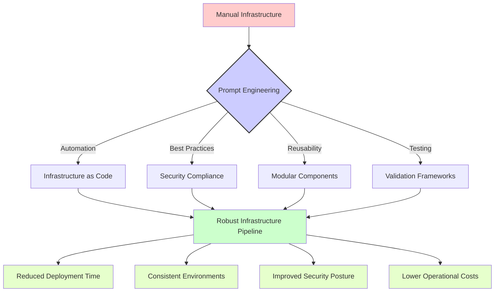

[🏠 Home](index.md)

# Infrastructure as Code

## Overview

# 🔥 Infrastructure as Code (IaC) Prompts

This section contains practical prompt templates designed for DevOps engineers and infrastructure professionals working with Infrastructure as Code tools. These prompts have been crafted to solve real-world challenges in infrastructure automation, deployment, and management.

## 📑 Table of Contents

- [🛠️ Available Prompt Templates](#available-prompt-templates)
- [📊 Understanding Prompt Impact](#understanding-prompt-impact)
- [🌟 Real-World Use Cases](#real-world-use-cases)
- [📝 Usage Examples](#usage-examples)
- [👥 Contributing](#contributing)

## 🛠️ Available Prompt Templates

### Ansible Templates

| Prompt File | Description | Use Case |
|-------------|-------------|----------|
| [idempotent-playbook.prompt](./ansible/idempotent-playbook.prompt) | Ansible playbook idempotency improvements | Create reliable, repeatable Ansible configurations |

### Terraform Templates

| Prompt File | Description | Use Case |
|-------------|-------------|----------|
| [create-module.prompt](./terraform/create-module.prompt) | Terraform module development | Build reusable infrastructure components |
| [security-baseline-check.prompt](./terraform/security-baseline-check.prompt) | Terraform security validation | Ensure infrastructure meets security standards |

### Vagrant Templates

| Prompt File | Description | Use Case |
|-------------|-------------|----------|
| [init-vagrant-lab.prompt](./vagrant/init-vagrant-lab.prompt) | Vagrant lab environment setup | Create development and testing environments |
| [multi-vm-topology.prompt](./vagrant/multi-vm-topology.prompt) | Multi-VM environment configuration | Design complex multi-machine topologies |
| [vagrant-packer-builder.prompt](./vagrant/vagrant-packer-builder.prompt) | Vagrant box creation with Packer | Build custom, reusable Vagrant boxes |

## 📊 Understanding Prompt Impact

The following diagram illustrates how these IaC prompts can transform manual infrastructure work into automated, version-controlled processes:



## 🌟 Real-World Use Cases

These Infrastructure as Code prompts are particularly valuable for:

1. **🚀 Continuous Delivery**: Building reliable infrastructure pipelines for application deployment

2. **🔄 Environment Parity**: Ensuring development, testing, and production environments are identical

3. **📊 Compliance Automation**: Codifying regulatory and security requirements into infrastructure templates

4. **🔍 Infrastructure Testing**: Creating comprehensive test suites for infrastructure validation

5. **📦 Reusable Components**: Developing modular, shareable infrastructure building blocks

## 📝 Usage Examples

### Example 1: Creating an Idempotent Ansible Playbook

When you need to improve an existing Ansible playbook:

```
[Copy and paste the idempotent-playbook.prompt content here]

Here's my playbook that needs improvement:

---
- hosts: webservers
  tasks:
    - name: Install nginx
      apt:
        name: nginx
        state: present
    - name: Start nginx
      service:
        name: nginx
        state: started
```

### Example 2: Developing a Terraform Module

```
[Copy and paste the create-module.prompt content here]

I need a Terraform module for AWS that:
- Creates a VPC with public and private subnets
- Sets up appropriate security groups
- Configures proper IAM roles
- Follows security best practices
```

### Example 3: Setting Up a Multi-VM Lab Environment

```
[Copy and paste the multi-vm-topology.prompt content here]

I need a Vagrant configuration for a lab environment with:
- 1 load balancer (nginx)
- 3 web servers (apache)
- 1 database server (postgresql)
- Proper networking between components
```

## Contributing

We welcome contributions to improve these prompts or add new ones related to Infrastructure as Code. Please consider adding:

- Additional prompt templates for other IaC tools like CloudFormation, Pulumi, etc.
- Example responses that showcase effective AI-assisted infrastructure transformations
- Diagrams illustrating complex workflows that can benefit from these prompts

---

## `idempotent-playbook.prompt`

```text
# 🧠 Prompt – Write an Idempotent Ansible Playbook

You are an automation engineer. Your task is to create or refactor an Ansible playbook to ensure it is fully idempotent.

---

## ✅ Technical Requirements

1. Ensure each task:
   - Uses `state:` (e.g., present, latest, started)
   - Checks conditions with `when:`, `creates:`, or `stat`
   - Avoids shell unless strictly necessary

2. Follow Ansible best practices:
   - Use roles, handlers, and variables
   - Keep output clean and meaningful

---

## 📜 Workflow Expectations

- Include test strategy for idempotency
- Explain how each task avoids unnecessary change

---

## 🧑‍💻 Presentation Style

- Use YAML with clear spacing
- Comment key logic areas

---

## 🧾 Output Specification

- Full Ansible playbook
- Idempotency test run output

```

---

## `create-module.prompt`

```text
# 🧠 Prompt – Create a Reusable Terraform Module

You are an infrastructure-as-code engineer. Your task is to create a reusable Terraform module for deploying cloud resources (e.g., an AWS EC2 instance or Azure VM).

---

## ✅ Technical Requirements

1. Define:
   - Input variables with types, descriptions, and defaults
   - Output values
   - Proper `main.tf`, `variables.tf`, `outputs.tf` structure

2. Follow naming conventions and resource tagging

3. Optional:
   - Support multiple environments (dev, staging, prod)

---

## 📜 Workflow Expectations

- Validate input constraints (e.g., length, regex)
- Structure module for easy consumption via `source = "./modules/xyz"`
- Include minimal but complete example usage

---

## 🧑‍💻 Presentation Style

- Use comments to explain block purpose
- Align = signs in variable definitions for clarity

---

## 🧾 Output Specification

- `main.tf`, `variables.tf`, `outputs.tf` files
- Sample `terraform.tfvars` and usage example

```

---

## `security-baseline-check.prompt`

```text
# 🧠 Prompt – Verify Terraform Configurations Against Security Baselines

You are a cloud security engineer. Your task is to inspect Terraform configuration and verify compliance with security best practices.

---

## ✅ Technical Requirements

1. Analyze Terraform code for:
   - Open security groups or public S3 buckets
   - Unencrypted EBS volumes or missing IAM conditions

2. Recommend `aws_`, `azurerm_`, or `google_` resource improvements

3. Optionally suggest integration with tools:
   - `tfsec`, `Checkov`, `OPA`

---

## 📜 Workflow Expectations

- Highlight insecure default settings
- Provide CLI or CI/CD scan examples
- Explain why each recommendation matters

---

## 🧑‍💻 Presentation Style

- Markdown report style
- Group by resource type or issue severity

---

## 🧾 Output Specification

- Security findings summary
- Remediation actions with Terraform syntax

```

---

## `init-vagrant-lab.prompt`

```text
# 🧠 Prompt – Initialize a Vagrant Lab Environment

You are an infrastructure-as-code engineer. Your task is to generate a Vagrantfile that sets up a minimal lab environment using VirtualBox or another supported provider.

---

## ✅ Technical Requirements

1. Provision at least one VM (e.g., Ubuntu 22.04)
2. Expose SSH and forwarded ports (e.g., HTTP 80, HTTPS 443)
3. Use synced folders between host and guest
4. Ensure `vagrant up` runs idempotently
5. Optional: Allow override via ENV variables or CLI arguments

---

## 📜 Workflow Expectations

- Validate box availability and network accessibility
- Include inline comments for learning or collaboration

---

## 🧑‍💻 Presentation Style

- Use consistent indentation and inline comments
- Document each VM config block clearly

---

## 🧾 Output Specification

- Full `Vagrantfile`
- Summary of services exposed and ports used
- Tips for next steps: provisioning, SSH, destroy

```

---

## `multi-vm-topology.prompt`

```text
# 🧠 Prompt – Build a Multi-VM Topology with Vagrant

You are designing a development lab with multiple VMs using Vagrant. Your task is to generate a Vagrantfile that provisions a master-node and multiple worker-nodes.

---

## ✅ Technical Requirements

1. Define:
   - Master VM with fixed IP
   - 2+ Worker VMs on internal network
2. Use private network and host-only adapter
3. Allow host to access all VMs via assigned IPs
4. Enable provisioning (inline shell or Ansible)
5. Optional: Auto-generate hostnames based on loop index

---

## 📜 Workflow Expectations

- Recommend OS box and resource constraints (CPU, RAM)
- Map out private IP scheme
- Explain multi-VM syntax (`config.vm.define` block)

---

## 🧑‍💻 Presentation Style

- Structure Vagrantfile into sections
- Add comments to describe network setup
- Keep provisioning minimal and readable

---

## 🧾 Output Specification

- Full Vagrantfile with N VM definitions
- Sample provisioning script if included
- Diagram or table of IP/hostnames

```

---

## `vagrant-packer-builder.prompt`

```text
# 🧠 Prompt – Create a Vagrant Box Using Packer

You are a DevOps engineer. Your task is to create a Vagrant-compatible base box using Packer, and use it within a Vagrantfile.

---

## ✅ Technical Requirements

1. Write a `packer.json` (or HCL) to:
   - Build Ubuntu or CentOS base image
   - Install required tools (curl, git, Docker, etc.)
   - Output `.box` compatible with VirtualBox

2. Then write a Vagrantfile to use that box locally

---

## 📜 Workflow Expectations

- Explain each Packer provisioner and builder block
- Show version compatibility (Packer, Vagrant)
- Provide cleanup commands if needed

---

## 🧑‍💻 Presentation Style

- Packer and Vagrant snippets separated
- Inline comments to explain every major step

---

## 🧾 Output Specification

- `packer.json` or HCL config
- `Vagrantfile` using built box
- Summary of installed tools and usage steps

```

