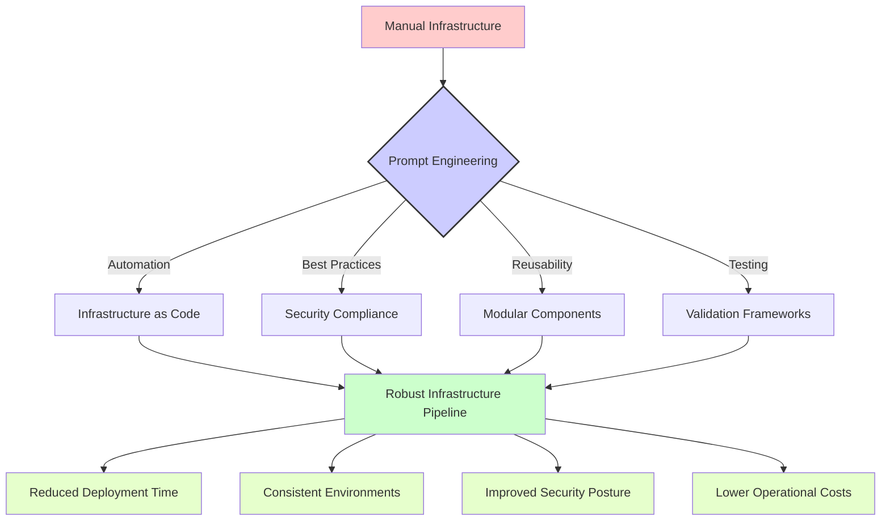

# Iac
[🔙 Return to homepage](../index.md)

## Overview
# 🔥 Infrastructure as Code (IaC) Prompts

This section contains practical prompt templates designed for DevOps engineers and infrastructure professionals working with Infrastructure as Code tools. These prompts have been crafted to solve real-world challenges in infrastructure automation, deployment, and management.

## 📑 Table of Contents

- [🛠️ Available Prompt Templates](#available-prompt-templates)
- [📊 Understanding Prompt Impact](#understanding-prompt-impact)
- [🌟 Real-World Use Cases](#real-world-use-cases)
- [📝 Usage Examples](#usage-examples)
- [👥 Contributing](#contributing)

## 🛠️ Available Prompt Templates

### Ansible Templates

| Prompt File | Description | Use Case |
|-------------|-------------|----------|
| [idempotent-playbook.prompt](./ansible/idempotent-playbook.prompt) | Ansible playbook idempotency improvements | Create reliable, repeatable Ansible configurations |

### Terraform Templates

| Prompt File | Description | Use Case |
|-------------|-------------|----------|
| [create-module.prompt](./terraform/create-module.prompt) | Terraform module development | Build reusable infrastructure components |
| [security-baseline-check.prompt](./terraform/security-baseline-check.prompt) | Terraform security validation | Ensure infrastructure meets security standards |

### Vagrant Templates

| Prompt File | Description | Use Case |
|-------------|-------------|----------|
| [init-vagrant-lab.prompt](./vagrant/init-vagrant-lab.prompt) | Vagrant lab environment setup | Create development and testing environments |
| [multi-vm-topology.prompt](./vagrant/multi-vm-topology.prompt) | Multi-VM environment configuration | Design complex multi-machine topologies |
| [vagrant-packer-builder.prompt](./vagrant/vagrant-packer-builder.prompt) | Vagrant box creation with Packer | Build custom, reusable Vagrant boxes |

## 📊 Understanding Prompt Impact

The following diagram illustrates how these IaC prompts can transform manual infrastructure work into automated, version-controlled processes:



## 🌟 Real-World Use Cases

These Infrastructure as Code prompts are particularly valuable for:

1. **🚀 Continuous Delivery**: Building reliable infrastructure pipelines for application deployment

2. **🔄 Environment Parity**: Ensuring development, testing, and production environments are identical

3. **📊 Compliance Automation**: Codifying regulatory and security requirements into infrastructure templates

4. **🔍 Infrastructure Testing**: Creating comprehensive test suites for infrastructure validation

5. **📦 Reusable Components**: Developing modular, shareable infrastructure building blocks

## 📝 Usage Examples

### Example 1: Creating an Idempotent Ansible Playbook

When you need to improve an existing Ansible playbook:

```
[Copy and paste the idempotent-playbook.prompt content here]

Here's my playbook that needs improvement:

---
- hosts: webservers
  tasks:
    - name: Install nginx
      apt:
        name: nginx
        state: present
    - name: Start nginx
      service:
        name: nginx
        state: started
```

### Example 2: Developing a Terraform Module

```
[Copy and paste the create-module.prompt content here]

I need a Terraform module for AWS that:
- Creates a VPC with public and private subnets
- Sets up appropriate security groups
- Configures proper IAM roles
- Follows security best practices
```

### Example 3: Setting Up a Multi-VM Lab Environment

```
[Copy and paste the multi-vm-topology.prompt content here]

I need a Vagrant configuration for a lab environment with:
- 1 load balancer (nginx)
- 3 web servers (apache)
- 1 database server (postgresql)
- Proper networking between components
```

## 👥 Contributing

We welcome contributions to improve these prompts or add new ones related to Infrastructure as Code. Please consider adding:

- Additional prompt templates for other IaC tools like CloudFormation, Pulumi, etc.
- Example responses that showcase effective AI-assisted infrastructure transformations
- Diagrams illustrating complex workflows that can benefit from these prompts

## Prompts

- [idempotent-playbook.prompt](../prompts/idempotent-playbook.prompt)
- [create-module.prompt](../prompts/create-module.prompt)
- [security-baseline-check.prompt](../prompts/security-baseline-check.prompt)
- [init-vagrant-lab.prompt](../prompts/init-vagrant-lab.prompt)
- [multi-vm-topology.prompt](../prompts/multi-vm-topology.prompt)
- [vagrant-packer-builder.prompt](../prompts/vagrant-packer-builder.prompt)

---
[🔙 Return to homepage](../index.md)
