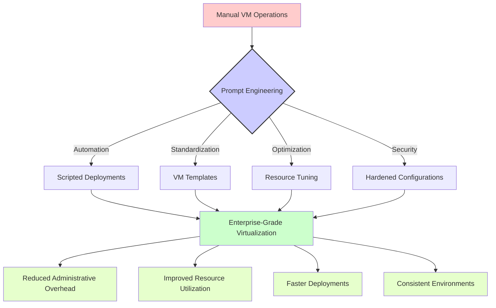

# Virtualization

## Overview

# 🔥 Virtualization Prompts

This section contains practical prompt templates designed for virtualization administrators and architects. These prompts have been crafted to solve real-world challenges in managing virtual machines, hypervisors, and containerization platforms.

## 📑 Table of Contents

- [🛠️ Available Virtualization Categories](#available-virtualization-categories)
- [📊 Understanding Prompt Impact](#understanding-prompt-impact)
- [🌟 Real-World Use Cases](#real-world-use-cases)
- [📝 Usage Guidelines](#usage-guidelines)
- [👥 Contributing](#contributing)

## 🛠️ Available Virtualization Categories

The following virtualization technology categories are available:

| Category | Description | Link |
|-------------|-------------|------|
| Proxmox | Prompts for managing Proxmox VE environments | [Proxmox Prompts](./proxmox/) |
| VirtualBox | Prompts for automating VirtualBox operations | [VirtualBox Prompts](./virtualbox/) |

## 📊 Understanding Prompt Impact

The following diagram illustrates how these virtualization prompts can transform manual operations into streamlined, automated processes:



## 🌟 Real-World Use Cases

These virtualization prompts are particularly valuable for:

1. **🚀 Rapid Deployment**: Creating consistently configured virtual machines quickly

2. **🔄 Resource Optimization**: Fine-tuning VM resource allocations and performance

3. **📊 Environment Management**: Managing complex environments with multiple hypervisors

4. **🔍 Troubleshooting**: Diagnosing and resolving virtualization-specific issues

5. **🔒 Security Hardening**: Implementing security best practices across VM fleets

## 📝 Usage Guidelines

These prompts are designed to work with various virtualization technologies. To get the best results:

1. **Be Specific**: Include hypervisor version, VM specifications, and exact requirements
2. **Provide Context**: Describe your environment constraints and operational policies
3. **Include Examples**: Where possible, include examples of existing configurations
4. **Clarify Goals**: Specify whether you're optimizing for performance, density, security, etc.

## 👥 Contributing

We welcome contributions to improve these prompts or add new ones related to virtualization technologies. Please consider adding:

- Additional prompt templates for other virtualization platforms (VMware, Hyper-V, KVM, etc.)
- Example responses that showcase effective VM configurations and scripts
- Diagrams illustrating complex virtualization architectures that can benefit from these prompts

---

## `optimize-proxmox-script.prompt`

```text
🧠 Prompt – Optimize a Shell Script for Proxmox (DevSecOps-focused)

You are a DevSecOps expert and Team Lead. Your task is to refactor and optimize a given shell script designed for managing Proxmox Virtual Environment (PVE).

Please follow these technical and procedural principles strictly:

---

✅ Technical Requirements

1. Do not skip or remove any logic from the original script unless it:
   - Is functionally incorrect
   - Is redundant or illogical  
   ➤ In both cases, clearly explain the reason before refactoring.

2. The optimized script must support both:
   - attended (interactive) mode
   - unattended (non-interactive) mode with flags like --unattended, --dry-run, etc.

3. Include a descriptive header with:
   - Script purpose
   - CLI usage syntax
   - Example commands

4. Always use relative paths from the script directory (SCRIPT_DIR). Avoid hardcoded absolute paths.

5. Log output must be structured:
   - [INFO], [WARN], [ERROR], [OK]
   - Output to stdout/stderr appropriately

6. Refactor logic into well-named, reusable functions

7. If the script processes multiple items:
   - Output a final summary.csv or structured log at the end

8. Use both short and long CLI flags:
   - E.g., -d / --dry-run, -n / --name, -h / --help

---

📜 Workflow Expectations

- Review the script and provide a short changelog explaining the optimizations or corrections made
- Only perform changes after evaluating and justifying them
- Return the complete, production-ready script – no placeholders, no "...", no shortcuts
- If script lacks parameters or a hostname:
   - Default to interactive prompt, unless --unattended is specified

---

🧑‍💻 Presentation Style

- Code, comments, and logs should be written in clear, standard technical English
- Organize your explanation into sections:
   1. What was wrong
   2. Why it needed fixing
   3. What was done
   4. What the impact is

- Your tone should be professional, concise, and opinionated. Avoid blindly agreeing. Offer valid engineering counterpoints if something seems off.

---

🧾 Output Specification

You will be provided with a shell script. Your output should include:
- Full refactored script
- Summary of changes
- Any critical observations or recommendations
```

---

## `headless-automation.prompt`

```text
# 🧠 Prompt – Automate Headless VirtualBox VM Creation

You are managing a local lab using VirtualBox. Your task is to automate the setup of headless VMs using CLI or script.

---

## ✅ Technical Requirements

1. Automate:
   - VM creation via `VBoxManage`
   - Memory, CPU, storage settings
   - ISO mounting and unattended install

2. Start in headless mode with bridged or NAT network

---

## 📜 Workflow Expectations

- Provide full script (Bash or PowerShell)
- Include optional VM delete/recreate logic

---

## 🧑‍💻 Presentation Style

- Script with verbose logging
- Inline comments for each key step

---

## 🧾 Output Specification

- Script file
- Sample usage
- VM settings summary

```

