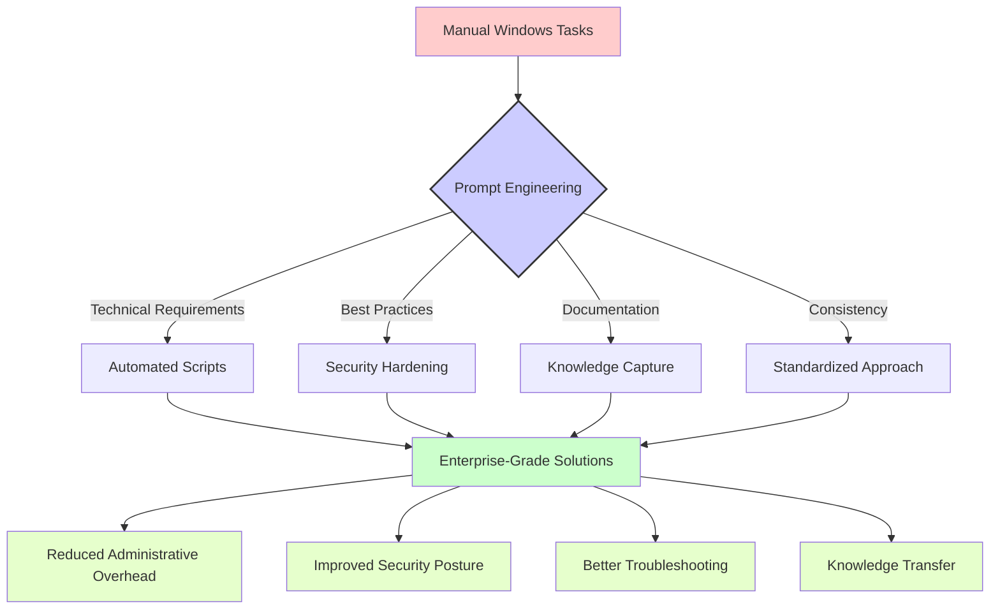

[🏠 Home](index.md)

# Windows

## Overview

# 🔥 Windows Administration Prompts

This section contains practical prompt templates designed for IT professionals working with Windows environments. These prompts have been crafted to solve real-world challenges in Windows system administration, PowerShell scripting, batch files, and Windows management.

## 📑 Table of Contents

- [🛠️ Available Prompt Templates](#available-prompt-templates)
- [📊 Understanding Prompt Impact](#understanding-prompt-impact)
- [🌟 Real-World Use Cases](#real-world-use-cases)
- [📝 Usage Examples](#usage-examples)
- [👥 Contributing](#contributing)

## 🛠️ Available Prompt Templates

The following prompt templates are available for Windows administration tasks:

| Prompt File | Description | Use Case |
|-------------|-------------|----------|
| [ad-healthcheck-prompt.prompt](./ad-healthcheck-prompt.prompt) | Active Directory health check automation | Assess and troubleshoot AD environments |
| [cmd-batch-automation.prompt](./cmd-batch-automation.prompt) | Windows batch scripting for automation | Create robust CMD batch files for repetitive tasks |
| [gpo-policy-hardening.prompt](./gpo-policy-hardening.prompt) | Group Policy security hardening | Enhance Windows security through GPO configurations |
| [powershell-script-hardening.prompt](./powershell-script-hardening.prompt) | PowerShell script security improvements | Develop secure and robust PowerShell scripts |
| [windows-service-wrapper.prompt](./windows-service-wrapper.prompt) | Windows service management | Create and manage Windows services efficiently |
| [windows-troubleshooting-diagnostic.prompt](./windows-troubleshooting-diagnostic.prompt) | Windows diagnostic procedures | Systematically troubleshoot Windows issues |

## 📊 Understanding Prompt Impact

The following diagram illustrates how these Windows administration prompts can transform basic administration tasks into structured, repeatable processes:



## 🌟 Real-World Use Cases

These Windows administration prompts are particularly valuable for:

1. **💼 Enterprise Administration**: Streamlining management of large Windows environments with consistent approaches

2. **🔒 Security Operations**: Implementing hardening measures across Active Directory and Windows systems

3. **🔄 IT Automation**: Converting manual Windows tasks into repeatable, error-free processes

4. **🛠️ Troubleshooting**: Systematically diagnosing and resolving Windows issues with structured methodology

5. **📊 Compliance**: Creating documented, auditable procedures that align with organizational policies

## 📝 Usage Examples

### Example 1: Running an Active Directory Health Check

When you need to assess the health of an AD environment:

```
[Copy and paste the ad-healthcheck-prompt.prompt content here]

Our environment details:
- Domain controllers: 3 (DC1, DC2, DC3)
- Forest functional level: Windows Server 2016
- Recently observed replication delays
```

### Example 2: Creating a Secure PowerShell Script

```
[Copy and paste the powershell-script-hardening.prompt content here]

Here's my script that needs security improvements:

$users = Get-ADUser -Filter *
foreach ($user in $users) {
    # Check last login
    $lastLogon = $user.LastLogonDate
    if ($lastLogon -lt (Get-Date).AddDays(-90)) {
        Disable-ADAccount -Identity $user.SamAccountName
    }
}
```

## Contributing

We welcome contributions to improve these prompts or add new ones related to Windows administration. Please consider adding:

- Additional prompt templates for specific Windows management tasks
- Example responses that showcase effective AI-assisted script transformations
- Diagrams illustrating complex workflows that can benefit from these prompts

---

## `ad-healthcheck-prompt.prompt`

```text
# 🧠 Prompt – Perform Active Directory Health Check

You are an Active Directory administrator. Your task is to generate a diagnostic script or procedure to assess the health of an AD domain.

---

## ✅ Technical Requirements

1. Check domain controllers for:
   - Replication status (use `repadmin`)
   - DNS registration, SYSVOL sync
   - Time synchronization

2. Review AD sites and services for misconfiguration

3. Collect and summarize `dcdiag`, `netdiag`, and event log outputs

---

## 📜 Workflow Expectations

- Script should be modular and reusable
- Provide optional HTML or CSV reporting output

---

## 🧑‍💻 Presentation Style

- Clear log sections per test
- Color/label severity in output if possible

---

## 🧾 Output Specification

- Health summary report
- Warnings or errors grouped by category
- Recommendations for remediation

```

---

## `cmd-batch-automation.prompt`

```text
# 🧠 Prompt – Automate Windows Tasks Using Batch Scripts

You are a Windows system administrator. Your task is to write or refactor a batch (.bat) script to automate administrative tasks in legacy or restricted environments where PowerShell is unavailable.

---

## ✅ Technical Requirements

1. Ensure script:
   - Runs silently and handles errors gracefully
   - Uses `IF`, `GOTO`, and `CALL` appropriately for flow control
   - Handles user elevation or prompts clearly (if needed)

2. Avoid deprecated DOS syntax or assumptions (e.g., 8.3 paths)

3. Make script modular and well-commented

---

## 📜 Workflow Expectations

- Review the batch logic and explain decisions made
- Fallback gracefully for missing tools (e.g., `net`, `reg`, `sc`)

---

## 🧑‍💻 Presentation Style

- Use clear indentation
- Add ECHO-based logging with timestamps if possible
- Include usage/help section at the top

---

## 🧾 Output Specification

- Full refactored batch script
- Usage examples
- Summary of key automation behaviors

```

---

## `gpo-policy-hardening.prompt`

```text
# 🧠 Prompt – Harden Group Policy Objects for Windows Environment

You are a Windows infrastructure engineer. Your task is to review and improve Group Policy configurations for security and operational efficiency.

---

## ✅ Technical Requirements

1. Focus areas:
   - Account policies (password, lockout)
   - User rights assignments
   - Security options (SMB signing, LAN Manager auth level)

2. Reference CIS Benchmark or Microsoft Security Baseline

3. Ensure GPOs are linked, filtered, and enforced appropriately

---

## 📜 Workflow Expectations

- Map GPO settings to business or compliance requirements
- Recommend GPO naming, versioning, and documentation practices

---

## 🧑‍💻 Presentation Style

- Table format or checklist preferred
- Highlight potential impact before/after

---

## 🧾 Output Specification

- Hardened policy summary
- Justification for each setting
- Optional: `.inf` export or `LGPO.exe` script reference

```

---

## `powershell-script-hardening.prompt`

```text
# 🧠 Prompt – Harden a PowerShell Script for Enterprise Use

You are a Windows Server administrator and PowerShell expert. Your task is to harden a PowerShell script for use in enterprise environments.

---

## ✅ Technical Requirements

1. Detect and mitigate security issues:
   - Unsafe `Invoke-Expression`, string parsing, or user input
   - Missing input validation or parameter types

2. Apply PowerShell best practices:
   - Use `CmdletBinding()` and `[Parameter()]`
   - Structured logging via `Write-Verbose`, `Write-Error`, `Write-Host`
   - Avoid deprecated cmdlets or legacy practices

3. Ensure script is:
   - Compatible with PowerShell 5.1+ and Core
   - Capable of silent/unattended execution using parameters

---

## 📜 Workflow Expectations

- Review all function definitions and param blocks
- Suggest code signing and execution policy best practices
- Include fallback logic if run with insufficient privileges

---

## 🧑‍💻 Presentation Style

- Use standard casing (PascalCase for functions, camelCase for variables)
- Provide verbose mode toggle using `$PSCmdlet.MyInvocation.BoundParameters`
- Inline comments for all complex logic blocks

---

## 🧾 Output Specification

- Refactored PowerShell script
- Summary of hardening improvements
- Compatibility & security checklist

```

---

## `windows-service-wrapper.prompt`

```text
# 🧠 Prompt – Wrap a Script or Executable as a Windows Service

You are a Windows automation engineer. Your task is to create a method for running a script or application as a Windows service.

---

## ✅ Technical Requirements

1. Wrap non-service application using:
   - `sc.exe`, `srvany.exe`, `nssm`, or PowerShell

2. Ensure service:
   - Restarts on failure
   - Runs under proper service account
   - Logs to Event Viewer or custom location

3. Include start/stop logic that gracefully handles termination

---

## 📜 Workflow Expectations

- Script should support install/uninstall/restart
- Document registry modifications (if applicable)

---

## 🧑‍💻 Presentation Style

- Use PowerShell preferred, fallback to `sc.exe` if needed
- Include example usage with parameters

---

## 🧾 Output Specification

- Installable wrapper script
- Instructions and limitations
- Troubleshooting notes

```

---

## `windows-troubleshooting-diagnostic.prompt`

```text
# 🧠 Prompt – Diagnose and Troubleshoot a Windows Server Issue

You are a senior Windows engineer. Your task is to diagnose a reported issue on a Windows Server system based on logs, symptoms, and limited user feedback.

---

## ✅ Technical Requirements

1. Analyze provided data:
   - Event logs, system reports, screenshots, and symptoms

2. Identify root cause related to:
   - Networking, services, permissions, GPO, or registry misconfiguration

3. Suggest resolution steps:
   - Commands (`sfc /scannow`, `DISM`, `gpresult`, etc.)
   - Scripts, patches, or registry edits if needed

4. Offer preventive recommendations:
   - Monitoring, alerting, update strategy

---

## 📜 Workflow Expectations

- Use methodical triage: check logs → isolate subsystem → confirm config → fix
- Avoid recommending reboots unless strictly required
- Always cross-reference solutions with Microsoft documentation if possible

---

## 🧑‍💻 Presentation Style

- Use checklists or bullet steps
- Show PowerShell/CMD examples inline
- Clarity and brevity > verbosity

---

## 🧾 Output Specification

- Summary of analysis
- Step-by-step resolution
- Root cause explanation + mitigation tips

```

