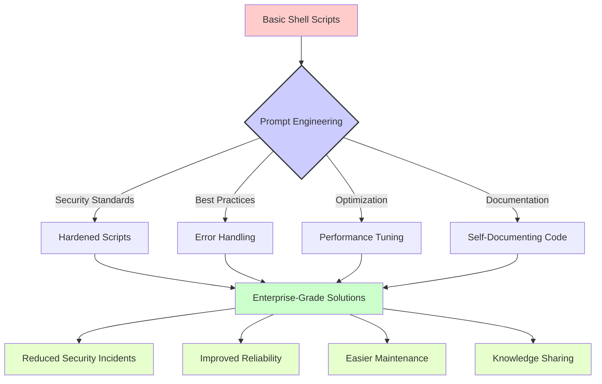

# Bash & Linux Prompts

[](../../README.md)

This section contains practical prompt templates designed for system administrators and DevOps professionals working with Linux environments. These prompts have been crafted to solve real-world challenges in Linux shell scripting, system hardening, and administration.

## Table of Contents

- [Available Prompt Templates](#available-prompt-templates)
- [Understanding Prompt Impact](#understanding-prompt-impact)
- [Real-World Use Cases](#real-world-use-cases)
- [Usage Examples](#usage-examples)
- [Contributing](#contributing)

## Available Prompt Templates

The following prompt templates are available for Linux and Bash scripting tasks:

| Prompt File | Description | Use Case |
|-------------|-------------|----------|
| [harden-linux-shell.promt](./harden-linux-shell.promt) | Linux shell security hardening | Enhance security of shell scripts and Linux environments |

## Understanding Prompt Impact

The following diagram illustrates how these Bash and Linux prompts can transform basic administration tasks into secure, automated processes:



## Real-World Use Cases

These Bash and Linux prompts are particularly valuable for:

1. **🔒 Security Hardening**: Implementing defense-in-depth measures for Linux systems

2. **🛠️ DevOps Automation**: Creating reliable shell scripts for CI/CD pipelines

3. **📊 System Administration**: Streamlining repetitive Linux administration tasks

4. **🔄 Configuration Management**: Ensuring consistent system configurations across multiple hosts

5. **🚨 Incident Response**: Building tools for quick response to security incidents

## Usage Examples

### Example 1: Hardening a Linux Shell Script

When you need to improve security in a shell script:

```
[Copy and paste the harden-linux-shell.promt content here]

Here's my script that needs security improvements:

#!/bin/bash
echo "Starting backup process..."
rsync -av /var/www/ /backup/www/
echo "Backup completed"
```

### Example 2: Creating a System Monitoring Script

```
[Copy and paste the harden-linux-shell.promt content here]

I need a secure monitoring script that:
- Checks system load average
- Monitors disk space
- Alerts when thresholds are exceeded
- Runs securely as a non-privileged user
```

## Contributing

We welcome contributions to improve these prompts or add new ones related to Linux and Bash. Please consider adding:

- Additional prompt templates for specific Linux administration tasks
- Example responses that showcase effective AI-assisted script transformations
- Diagrams illustrating complex workflows that can benefit from these prompts