# 🔥 DevOps Prompts

This section contains practical prompt templates designed for DevOps engineers and CI/CD professionals. These prompts have been crafted to solve real-world challenges in continuous integration, delivery, deployment, and release management.

## 📑 Table of Contents

- [🛠️ Available Prompt Templates](#available-prompt-templates)
- [📊 Understanding Prompt Impact](#understanding-prompt-impact)
- [🌟 Real-World Use Cases](#real-world-use-cases)
- [📝 Usage Examples](#usage-examples)
- [👥 Contributing](#contributing)

## 🛠️ Available Prompt Templates

The following prompt templates are available for DevOps tasks:

| Prompt File | Description | Use Case |
|-------------|-------------|----------|
| [create-release-notes.prompt](./create-release-notes.prompt) | Automated release notes generation | Create comprehensive, standardized release documentation |

## 📊 Understanding Prompt Impact

The following diagram illustrates how these DevOps prompts can transform manual processes into streamlined workflows:

```mermaid
flowchart TD
    A[Manual DevOps Tasks] --> B{Prompt Engineering}
    B -->|Automation| C[Standardized Processes]
    B -->|Documentation| D[Knowledge Sharing]
    B -->|Consistency| E[Repeatable Workflows]
    B -->|Quality| F[Error Reduction]
    
    C --> G[CI/CD Excellence]
    D --> G
    E --> G
    F --> G
    
    G --> H[Faster Releases]
    G --> I[Improved Code Quality]
    G --> J[Better Team Collaboration]
    G --> K[Enhanced Customer Satisfaction]
    
    style A fill:#ffcccc
    style G fill:#ccffcc
    style B fill:#ccccff,stroke:#333,stroke-width:2px
    style H fill:#e6ffcc
    style I fill:#e6ffcc
    style J fill:#e6ffcc
    style K fill:#e6ffcc
```



## 🌟 Real-World Use Cases

These DevOps prompts are particularly valuable for:

1. **🚀 Release Management**: Streamlining the process of documenting and communicating changes

2. **🔄 CI/CD Pipeline Design**: Creating efficient, automated workflows for code delivery

3. **📊 Change Management**: Tracking and documenting changes across systems and applications

4. **🔍 Quality Assurance**: Ensuring consistent quality checks throughout the delivery pipeline

5. **📦 Deployment Automation**: Standardizing deployment procedures across environments

## 📝 Usage Examples

### Example 1: Generating Comprehensive Release Notes

When preparing for a product release:

```
[Copy and paste the create-release-notes.prompt content here]

Project: Customer Portal
Version: 2.4.0
Changes since last release:
- Added support for multi-factor authentication
- Fixed bug in payment processing module
- Improved performance of search functionality
- Updated third-party libraries for security patches
```

### Example 2: Creating Release Notes from Git History

```
[Copy and paste the create-release-notes.prompt content here]

Here's our git log for the release:

commit a1b2c3d4e5f6...
Author: Developer Name
Date: Mon Apr 10 10:30:45 2023
    Implement OAuth2 authentication support

commit f6e5d4c3b2a1...
Author: Developer Name
Date: Fri Apr 7 15:22:33 2023
    Fix critical bug in user session handling

commit ...
```

## 👥 Contributing

We welcome contributions to improve these prompts or add new ones related to DevOps practices. Please consider adding:

- Additional prompt templates for CI/CD, monitoring, observability, etc.
- Example responses that showcase effective AI-assisted DevOps transformations
- Diagrams illustrating complex workflows that can benefit from these prompts