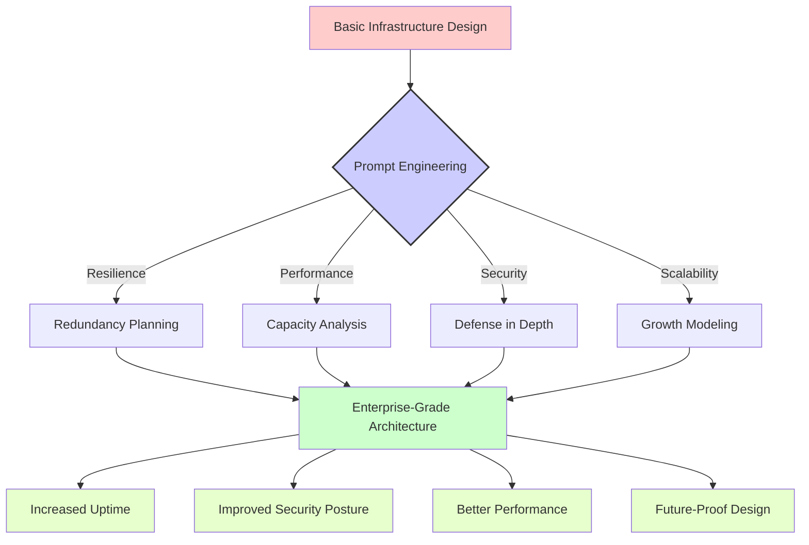

# Infrastructure Design Prompts

[](../../README.md)

This section contains practical prompt templates designed for network engineers and infrastructure architects. These prompts have been crafted to solve real-world challenges in designing, implementing, and maintaining robust IT infrastructure.

## Table of Contents

- [Available Prompt Templates](#available-prompt-templates)
- [Understanding Prompt Impact](#understanding-prompt-impact)
- [Real-World Use Cases](#real-world-use-cases)
- [Usage Examples](#usage-examples)
- [Contributing](#contributing)

## Available Prompt Templates

The following prompt templates are available for infrastructure design tasks:

| Prompt File | Description | Use Case |
|-------------|-------------|----------|
| [design-ha-network.prompt](./design-ha-network.prompt) | High-availability network architecture | Design resilient network infrastructures |

## Understanding Prompt Impact

The following diagram illustrates how these infrastructure prompts can transform basic designs into robust, resilient architectures:



## Real-World Use Cases

These infrastructure design prompts are particularly valuable for:

1. **🔄 Network Resilience**: Designing fault-tolerant network architectures

2. **🚀 Data Center Planning**: Creating optimized data center layouts and interconnections

3. **☁️ Hybrid Cloud Design**: Architecting seamless hybrid environments

4. **🔒 Security Architecture**: Implementing defense-in-depth strategies

5. **📊 Capacity Planning**: Forecasting growth and resource requirements

## Usage Examples

### Example 1: Designing a Highly Available Network

When planning a resilient network architecture:

```
[Copy and paste the design-ha-network.prompt content here]

Requirements:
- 99.99% uptime SLA
- Multi-region presence (US East, US West, EU)
- Support for 5,000 concurrent users
- Compliance with GDPR and HIPAA
- Budget constraints: $XXX,XXX initial, $XX,XXX monthly
```

### Example 2: Upgrading Legacy Infrastructure

```
[Copy and paste the design-ha-network.prompt content here]

Current environment:
- Single data center
- Legacy routers and switches (5+ years old)
- No redundant internet connections
- Basic firewall protection
- Frequent outages during peak times

Goal: Transform into a highly available, modern infrastructure
```

## Contributing

We welcome contributions to improve these prompts or add new ones related to infrastructure design. Please consider adding:

- Additional prompt templates for network design, data center architecture, etc.
- Example responses that showcase effective AI-assisted infrastructure planning
- Diagrams illustrating complex infrastructure patterns that can benefit from these prompts