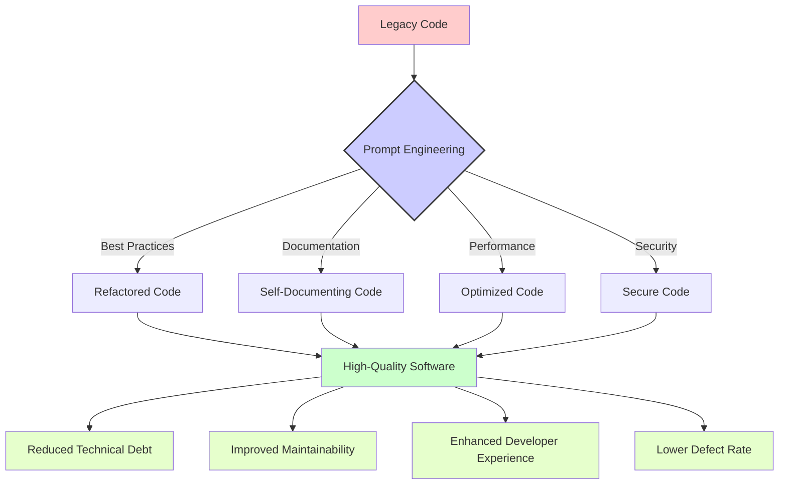

# 🔥 Programming Prompts

This section contains practical prompt templates designed for software developers and programmers. These prompts have been crafted to solve real-world challenges in code review, refactoring, optimization, and best practices implementation.

## 📑 Table of Contents

- [🛠️ Available Prompt Templates](#available-prompt-templates)
- [📊 Understanding Prompt Impact](#understanding-prompt-impact)
- [🌟 Real-World Use Cases](#real-world-use-cases)
- [📝 Usage Examples](#usage-examples)
- [👥 Contributing](#contributing)

## 🛠️ Available Prompt Templates

The following prompt templates are available for programming tasks:

| Prompt File | Description | Use Case |
|-------------|-------------|----------|
| [code-review-refactor.prompt](./code-review-refactor.prompt) | Code review and refactoring assistance | Improve code quality and maintainability |

## 📊 Understanding Prompt Impact

The following diagram illustrates how these programming prompts can transform legacy code into high-quality, maintainable software:



## 🌟 Real-World Use Cases

These programming prompts are particularly valuable for:

1. **🔍 Code Reviews**: Streamlining peer review processes with systematic analysis

2. **🧹 Legacy Code Modernization**: Bringing old code up to modern standards

3. **📊 Technical Debt Reduction**: Systematically improving code quality

4. **🔒 Security Hardening**: Identifying and fixing potential vulnerabilities

5. **📚 Knowledge Transfer**: Helping junior developers understand code patterns

## 📝 Usage Examples

### Example 1: Refactoring Legacy Code

When you need to improve code quality:

```
[Copy and paste the code-review-refactor.prompt content here]

Please review and refactor this legacy code:

function doStuff(a, b, c) {
  var x = 0;
  if (a > 0) {
    x = b + c;
  } else {
    x = b - c;
  }
  if (x > 10) {
    return "Big";
  } else {
    return "Small";
  }
}
```

### Example 2: Conducting a Code Review

```
[Copy and paste the code-review-refactor.prompt content here]

Please review this pull request:

class UserService {
  constructor(db) {
    this.db = db;
  }
  
  async getUser(id) {
    return await this.db.query("SELECT * FROM users WHERE id = " + id);
  }
  
  async createUser(userData) {
    return await this.db.query(`INSERT INTO users (name, email, password) 
                              VALUES ('${userData.name}', '${userData.email}', '${userData.password}')`);
  }
}
```

## 👥 Contributing

We welcome contributions to improve these prompts or add new ones related to programming tasks. Please consider adding:

- Additional prompt templates for different programming languages and paradigms
- Example responses that showcase effective AI-assisted code transformations
- Diagrams illustrating complex software patterns that can benefit from these prompts