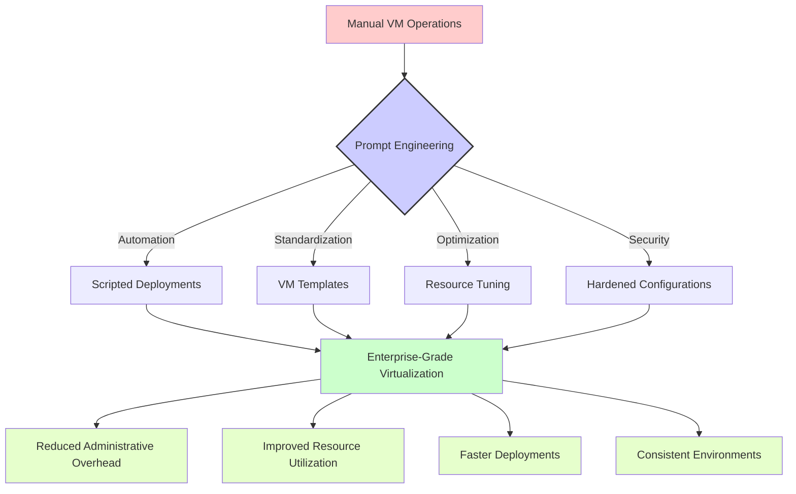

# Virtualization Prompts

This section contains practical prompt templates designed for virtualization administrators and architects. These prompts have been crafted to solve real-world challenges in managing virtual machines, hypervisors, and containerization platforms.

## Table of Contents

- [Available Virtualization Categories](#available-virtualization-categories)
- [Understanding Prompt Impact](#understanding-prompt-impact)
- [Real-World Use Cases](#real-world-use-cases)
- [Usage Guidelines](#usage-guidelines)
- [Contributing](#contributing)

## Available Virtualization Categories

The following virtualization technology categories are available:

| Category | Description | Link |
|-------------|-------------|------|
| Proxmox | Prompts for managing Proxmox VE environments | [Proxmox Prompts](./proxmox/) |
| VirtualBox | Prompts for automating VirtualBox operations | [VirtualBox Prompts](./virtualbox/) |

## Understanding Prompt Impact

The following diagram illustrates how these virtualization prompts can transform manual operations into streamlined, automated processes:

## Real-World Use Cases

These virtualization prompts are particularly valuable for:

1. **🚀 Rapid Deployment**: Creating consistently configured virtual machines quickly

2. **🔄 Resource Optimization**: Fine-tuning VM resource allocations and performance

3. **📊 Environment Management**: Managing complex environments with multiple hypervisors

4. **🔍 Troubleshooting**: Diagnosing and resolving virtualization-specific issues

5. **🔒 Security Hardening**: Implementing security best practices across VM fleets

## Usage Guidelines

These prompts are designed to work with various virtualization technologies. To get the best results:

1. **Be Specific**: Include hypervisor version, VM specifications, and exact requirements
2. **Provide Context**: Describe your environment constraints and operational policies
3. **Include Examples**: Where possible, include examples of existing configurations
4. **Clarify Goals**: Specify whether you're optimizing for performance, density, security, etc.

## Contributing

We welcome contributions to improve these prompts or add new ones related to virtualization technologies. Please consider adding:

- Additional prompt templates for other virtualization platforms (VMware, Hyper-V, KVM, etc.)
- Example responses that showcase effective VM configurations and scripts
- Diagrams illustrating complex virtualization architectures that can benefit from these prompts