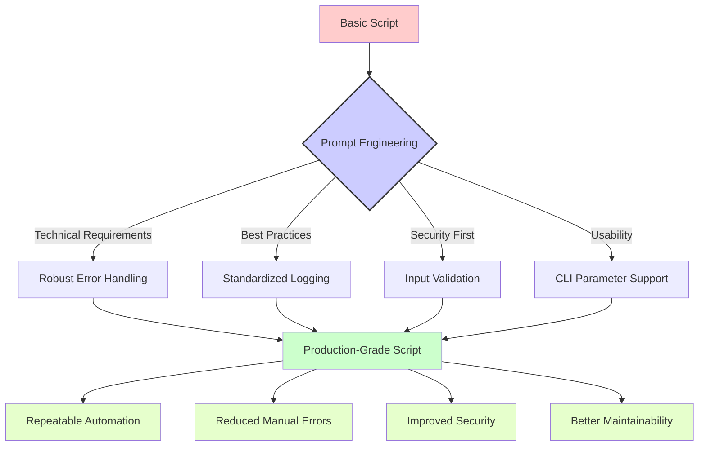

# Proxmox Virtualization Prompts

[](../../../README.md) [](../README.md)

This section contains practical prompt templates designed for DevSecOps professionals working with Proxmox Virtual Environment (PVE). These prompts have been crafted to solve real-world challenges in Proxmox infrastructure management.

## Table of Contents

- [Script Optimization Prompt](#script-optimization-prompt)
- [Understanding Prompt Impact](#understanding-prompt-impact)
- [Real-World Use Cases](#real-world-use-cases)
- [Usage Examples](#usage-examples)
- [Contributing](#contributing)

## Script Optimization Prompt

The [optimize-proxmox-script.prompt](./optimize-proxmox-script.prompt) file provides a detailed template for requesting AI assistance with optimizing shell scripts for Proxmox environments. This prompt is specifically designed for DevSecOps professionals who need to ensure their automation scripts are robust, secure, and maintainable.

### Key Features

- **Comprehensive Technical Requirements**: Enforces best practices like proper error handling, logging, and parameter handling
- **Dual-Mode Support**: Ensures scripts work in both interactive and non-interactive execution modes
- **Security-First Approach**: Integrates DevSecOps principles throughout the optimization process
- **Standardized Documentation**: Requires clear headers, usage instructions, and examples
- **Code Quality Improvements**: Focuses on refactoring into reusable functions and eliminating redundancies

## Understanding Prompt Impact

The following diagram illustrates how a well-crafted prompt transforms basic scripts into production-grade tooling:



## Real-World Use Cases

The optimize-proxmox-script.prompt is particularly valuable for:

1. **Backup Script Enhancement**: Transforming basic backup scripts into robust solutions with error handling, notifications, and verification steps

2. **VM Management Automation**: Optimizing scripts that handle VM creation, cloning, and template management with proper validation and error recovery

3. **Infrastructure Monitoring**: Improving scripts that collect and report on Proxmox cluster health metrics

4. **Cluster Maintenance**: Enhancing scripts that handle node maintenance, live migration, and resource balancing

5. **Disaster Recovery**: Hardening scripts that manage failover processes and recovery procedures

## Usage Examples

### Example 1: Optimizing a Backup Script

When working with a basic Proxmox backup script, you might use the prompt like this:

```
[Copy and paste the optimize-proxmox-script.prompt content here]

Here's my script that needs optimization:

#!/bin/bash
# Basic backup script
vzdump 100 101 102 --compress zstd
mv /var/lib/vz/dump/*.vma.zst /mnt/backup/
```

### Example 2: Enhancing a VM Creation Script

```
[Copy and paste the optimize-proxmox-script.prompt content here]

Here's my VM creation script that needs improvement:

#!/bin/bash
# Create a VM
qm create 999 --memory 2048 --cores 2 --name test-vm
qm importdisk 999 /mnt/images/ubuntu.img local-lvm
qm set 999 --scsihw virtio-scsi-pci --scsi0 local-lvm:vm-999-disk-0
qm boot 999
```

## Contributing

We welcome contributions to improve these prompts or add new ones related to Proxmox administration. Please consider adding:

- Additional prompt templates for specific Proxmox management tasks
- Example responses that showcase effective AI-assisted script transformations
- Diagrams illustrating complex workflows that can benefit from these prompts