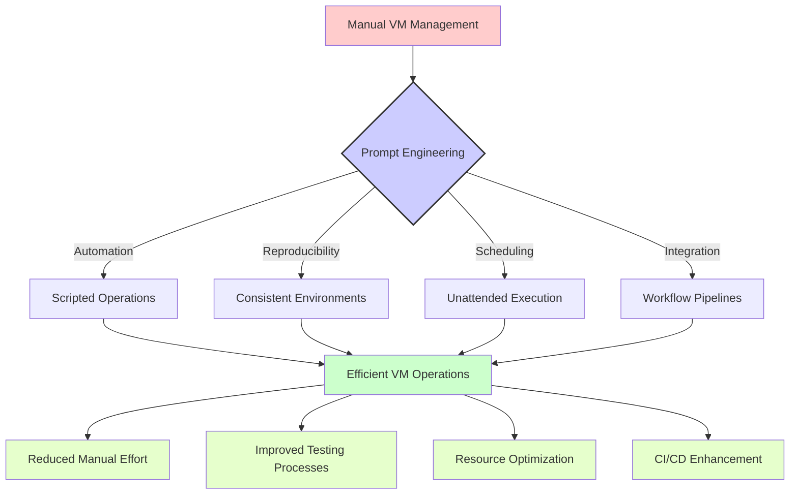

# 🔥 VirtualBox Automation Prompts

This section contains practical prompt templates designed for VirtualBox administrators and users. These prompts have been crafted to solve real-world challenges in managing, automating, and optimizing VirtualBox virtual machines.

## 📑 Table of Contents

- [🛠️ Available Prompt Templates](#available-prompt-templates)
- [📊 Understanding Prompt Impact](#understanding-prompt-impact)
- [🌟 Real-World Use Cases](#real-world-use-cases)
- [📝 Usage Examples](#usage-examples)
- [👥 Contributing](#contributing)

## 🛠️ Available Prompt Templates

The following prompt templates are available for VirtualBox tasks:

| Prompt File | Description | Use Case |
|-------------|-------------|----------|
| [headless-automation.prompt](./headless-automation.prompt) | VirtualBox headless VM automation | Run and manage VMs without GUI interaction |

## 📊 Understanding Prompt Impact

The following diagram illustrates how these VirtualBox prompts can transform manual VM management into automated processes:



## 🌟 Real-World Use Cases

These VirtualBox automation prompts are particularly valuable for:

1. **🧪 Test Automation**: Running automated tests in clean VM environments

2. **🔄 CI/CD Pipelines**: Integrating VM operations into build and deployment workflows

3. **🎓 Training Environments**: Setting up consistent training environments for multiple users

4. **📊 Resource Management**: Optimizing VM resource allocation and scheduling

5. **🧪 Software Evaluation**: Creating isolated environments for software evaluation and testing

## 📝 Usage Examples

### Example 1: Automating VM Creation and Management

When you need to create and manage VMs programmatically:

```
[Copy and paste the headless-automation.prompt content here]

I need to create a headless VM with:
- Ubuntu 22.04 LTS
- 2 CPUs, 4GB RAM
- 60GB storage
- Network configured for bridged mode
- Automatic startup and shutdown on host boot/shutdown
```

### Example 2: Setting Up a VM Test Environment

```
[Copy and paste the headless-automation.prompt content here]

I need to set up a testing environment with:
- 3 identical VMs based on Windows Server 2019
- Each with 2GB RAM and 1 CPU
- Connected through an internal network
- Configured to start and stop via script for automated testing
```

## 👥 Contributing

We welcome contributions to improve these prompts or add new ones related to VirtualBox automation. Please consider adding:

- Additional prompt templates for VM creation, management, and networking
- Example responses that showcase effective VirtualBox configurations
- Diagrams illustrating complex VM setups that can benefit from these prompts