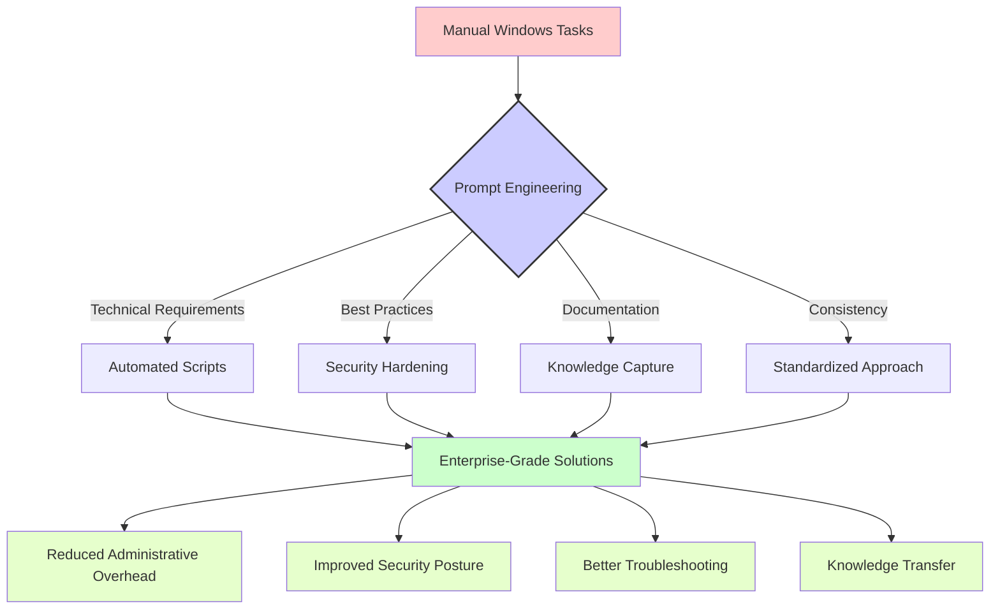

# Windows Administration Prompts

[](https://tamld.github.io/awesome-prompt-engineering/)

This section contains practical prompt templates designed for IT professionals working with Windows environments. These prompts have been crafted to solve real-world challenges in Windows system administration, PowerShell scripting, batch files, and Windows management.

## Table of Contents

- [Available Prompt Templates](#available-prompt-templates)
- [Understanding Prompt Impact](#understanding-prompt-impact)
- [Real-World Use Cases](#real-world-use-cases)
- [Usage Examples](#usage-examples)
- [Contributing](#contributing)

## Available Prompt Templates

The following prompt templates are available for Windows administration tasks:

| Prompt File | Description | Use Case |
|-------------|-------------|----------|
| [ad-healthcheck-prompt.prompt](./ad-healthcheck-prompt.prompt) | Active Directory health check automation | Assess and troubleshoot AD environments |
| [cmd-batch-automation.prompt](./cmd-batch-automation.prompt) | Windows batch scripting for automation | Create robust CMD batch files for repetitive tasks |
| [gpo-policy-hardening.prompt](./gpo-policy-hardening.prompt) | Group Policy security hardening | Enhance Windows security through GPO configurations |
| [powershell-script-hardening.prompt](./powershell-script-hardening.prompt) | PowerShell script security improvements | Develop secure and robust PowerShell scripts |
| [windows-service-wrapper.prompt](./windows-service-wrapper.prompt) | Windows service management | Create and manage Windows services efficiently |
| [windows-troubleshooting-diagnostic.prompt](./windows-troubleshooting-diagnostic.prompt) | Windows diagnostic procedures | Systematically troubleshoot Windows issues |

## Understanding Prompt Impact

The following diagram illustrates how these Windows administration prompts can transform basic administration tasks into structured, repeatable processes:



## Real-World Use Cases

These Windows administration prompts are particularly valuable for:

1. **Enterprise Administration**: Streamlining management of large Windows environments with consistent approaches

2. **Security Operations**: Implementing hardening measures across Active Directory and Windows systems

3. **IT Automation**: Converting manual Windows tasks into repeatable, error-free processes

4. **Troubleshooting**: Systematically diagnosing and resolving Windows issues with structured methodology

5. **Compliance**: Creating documented, auditable procedures that align with organizational policies

## Usage Examples

### Example 1: Running an Active Directory Health Check

When you need to assess the health of an AD environment:

```
[Copy and paste the ad-healthcheck-prompt.prompt content here]

Our environment details:
- Domain controllers: 3 (DC1, DC2, DC3)
- Forest functional level: Windows Server 2016
- Recently observed replication delays
```

### Example 2: Creating a Secure PowerShell Script

```
[Copy and paste the powershell-script-hardening.prompt content here]

Here's my script that needs security improvements:

$users = Get-ADUser -Filter *
foreach ($user in $users) {
    # Check last login
    $lastLogon = $user.LastLogonDate
    if ($lastLogon -lt (Get-Date).AddDays(-90)) {
        Disable-ADAccount -Identity $user.SamAccountName
    }
}
```

## Contributing

We welcome contributions to improve these prompts or add new ones related to Windows administration. Please consider adding:

- Additional prompt templates for specific Windows management tasks
- Example responses that showcase effective AI-assisted script transformations
- Diagrams illustrating complex workflows that can benefit from these prompts